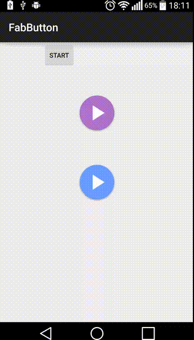

# FabProgress
 Android Floating ActionButton with a progress indicator ring
 [  ](https://bintray.com/ckurtm/maven/FabButton/_latestVersion)
 
##Demo:



 
# HOW TO ADD TO YOUR PROJECT

 Gradle:
 
 ```groovy
 dependencies {
         compile 'mbanje.kurt:fabbutton:1.0.0'
 }
 ```

##Usage

-	Use FabButton: (check the demo app included)
```xml
<view
        android:layout_width="@dimen/button_size"
        android:layout_height="@dimen/button_size"
        class="mbanje.kurt.fabbutton.FabButton"
        android:id="@+id/indeterminate"
        android:layout_gravity="center"
        android:color="#aa66cc"
        android:src="@drawable/ic_fab_play"
        android:visibility="visible"
        android:indeterminate="true"
        android:max="100"
        app:autoStart="true"
        app:progressColor="#0099cc"
        app:progressWidthRatio="0.2"
        android:layout_centerHorizontal="true"
        android:layout_above="@+id/determinate"
        android:layout_marginBottom="48dp"
        />
```
